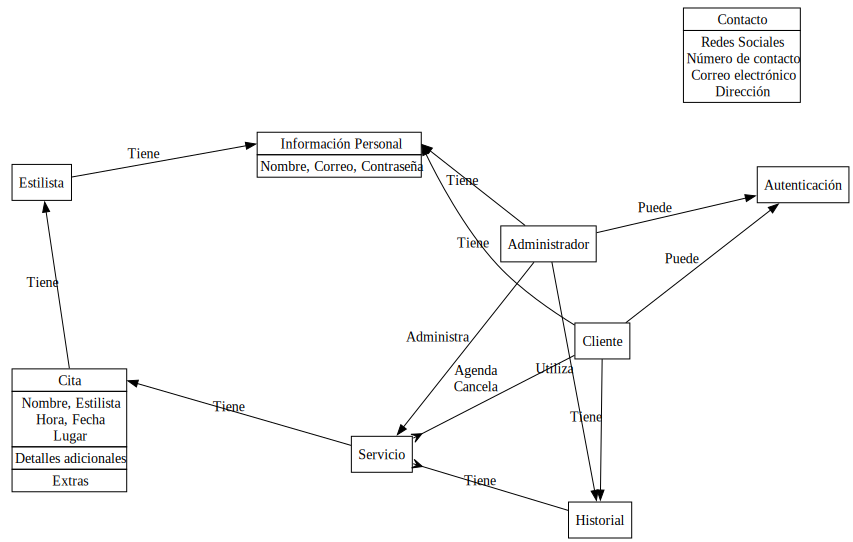
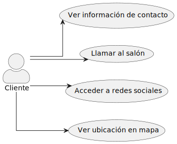
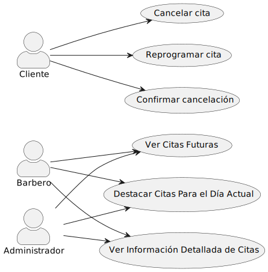
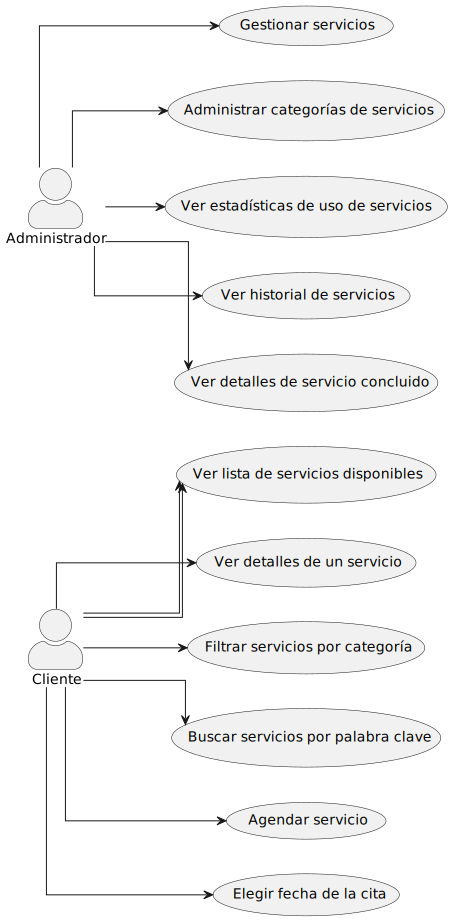

\newpage

# Requerimientos

## Funcionales

### Selección de servicios (cliente)

- **Descripción**: El sistema debe mostrar todos los servicios disponibles con imágenes y
  descripciones breves.
- **Detalles Adicionales**: Los clientes podrán agendar citas de forma individual o en
  grupo. Además, el sistema debe proporcionar opciones de búsqueda para facilitar la
  selección de servicios.

### Servicio (cliente)

- **Descripción**: Después de seleccionar un servicio, los clientes podrán elegir la
  fecha de la cita, agregar extras si están disponibles y dejar notas para el
  personal.
- **Detalles Adicionales**: Se debe garantizar que la selección de extras y la adición de
  notas sean claras y fáciles de entender para el cliente.

### Cancelación de citas

- **Descripción**: Los usuarios deben poder cancelar citas previamente agendadas.
- **Detalles Adicionales**: El sistema debe proporcionar una opción clara y accesible
  para que los usuarios cancelen sus citas, asegurando que el proceso sea fácil y sin
  complicaciones.

### Lista de servicios (administrador)

- **Descripción**: Los administradores deben poder ver todas las citas programadas, con
  opciones de filtrado por fecha.
- **Detalles Adicionales**: Las citas deben mostrarse en una lista clara y ordenada, con
  detalles como el nombre del cliente, la hora de inicio, el empleado asignado y una
  imagen representativa del servicio.

### Historial de servicios (administrador)

- **Descripción**: Los administradores deben poder acceder al historial de servicios
  concluidos, con opciones de filtrado por fecha.
- **Detalles Adicionales**: Al igual que con la lista de servicios, el historial debe
  mostrar información detallada sobre cada servicio concluido, incluyendo el nombre
  del cliente, la hora de inicio, el empleado asignado y una imagen representativa
  del servicio.

### Contacto (cliente)

- **Descripción**: La página debe incluir un apartado con información de contacto, como
  el número de teléfono, redes sociales y ubicación del salón.
- **Detalles Adicionales**: La información de contacto debe estar claramente visible y
  accesible para los clientes, facilitando así la comunicación con el salón de
  belleza.

### Visualización de Citas Futuras

- **Descripción**: El sistema debe incluir un apartado específico donde los
  administradores y barberos puedan visualizar las citas programadas para fechas
  futuras, distinto al apartado de citas pasadas. Este apartado permitirá el filtrado
  de citas por fecha para buscar citas programadas a largo plazo.
- **Detalles Adicionales**: Las citas futuras se mostrarán en un listado ordenado por
  día, comenzando con las citas para el día actual, seguidas por las citas para el
  día siguiente, y así sucesivamente. Para mejorar la claridad y la experiencia del
  usuario, las citas para el día actual se destacarán con la palabra "Hoy", seguidas
  de la información detallada de cada cita en tarjetas individuales. Las citas para
  los próximos días se mostrarán con la fecha correspondiente, proporcionando una
  visión clara de las citas programadas a futuro.

## No Funcionales

### Usabilidad

- **Descripción**: El sistema debe ser fácil de aprender y usar para los empleados
  del salón de belleza, con una interfaz intuitiva y amigable.

### Rendimiento

- **Descripción**: El sistema debe ser capaz de manejar un alto volumen de citas y
  transacciones simultáneas sin experimentar tiempos de respuesta significativos.

### Disponibilidad

- **Descripción**: El sistema debe estar disponible durante las horas de operación
  del salón de belleza, con un tiempo de inactividad planificado mínimo para
  mantenimiento y actualizaciones.

### Seguridad

- **Descripción**: Se deben implementar medidas de seguridad adecuadas para proteger
  los datos confidenciales de los clientes y del negocio, como información de citas,
  datos de inventario y detalles de pago.

### Escalabilidad

- **Descripción**: El sistema debe ser capaz de crecer y adaptarse fácilmente a
  medida que el negocio del salón de belleza se expanda, sin comprometer el
  rendimiento o la funcionalidad.

### Compatibilidad

- **Descripción**: El sistema debe ser compatible con una variedad de dispositivos y
  navegadores web comunes, para garantizar su accesibilidad desde diferentes
  plataformas.

### Mantenibilidad

- **Descripción**: El sistema debe ser fácil de mantener y actualizar, con un código
  limpio y bien documentado que permita a los desarrolladores realizar cambios sin
  problemas en el futuro.

### Confianza

- **Descripción**: Los usuarios deben confiar en la precisión y confiabilidad del
  sistema en la gestión de citas, agenda y control de inventario, para evitar errores
  que puedan afectar la experiencia del cliente.

### Cumplimiento normativo

- **Descripción**: El sistema debe cumplir con todas las regulaciones y estándares
  legales aplicables en cuanto a protección de datos, privacidad del cliente y
  seguridad de la información.

### Inicio de sesión

- **Descripción**: El sistema debe incluir un sistema de inicio de sesión para distinguir
  entre empleados y clientes.
- **Detalles Adicionales**: El sistema de inicio de sesión debe requerir credenciales
  válidas y proporcionar una interfaz clara para la identificación del usuario.

# Backlog (historias de usuario)

|Nombre|Nivel|
|:--|:-:|
|Como cliente puedo buscar servicios disponibles para ver que puedo agendar.|4|
|Como cliente puedo cancelar citas previamente agendadas.|2|
|Como administrador puedo ver una lista con todos los servicios que han sido agendados.|4|
|Como cliente puedo ver una lista de todos los servicios disponibles con imágenes y descripciones breves.|3|
|Como cliente puedo ver el historial de citas que he tenido, para llevar un registro.|5|
|Como administrador puedo ver un historial de todos los servicios, con descripción y ganancias.|8|
|Como cliente tengo acceso a un apartado de contacto para contactar con la empresa.|4|
|Como administrador puedo visualizar una lista de citas agendadas para conocer que citas vendrán al local en un determinado día.|3|
|Como cliente puedo iniciar sesión.|2|
|Como administrador puedo agregar nuevos servicios o eliminar los existentes para poder expandir el catálogo.|4|

\newpage

# Casos de Uso

## Contacto

Para ver el diagrama por favor referirse a \hyperref[casos_contacto]{la figura
\ref{casos_contacto}}

- Nombre del caso de uso: Ver información de contacto
- Actores: Cliente.
- Descripción: Permite al cliente ver la información de contacto del salón de
  belleza.

---

- Nombre del caso de uso: Llamar al salón
- Actores: Cliente.
- Descripción: Permite al cliente llamar al salón de belleza directamente desde la
  página de contacto.

---

- Nombre del caso de uso: Acceder a redes sociales
- Actores: Cliente.
- Descripción: Permite al cliente acceder a las redes sociales del salón de belleza
  desde la página de contacto.

---

- Nombre del caso de uso: Ver ubicación en mapa
- Actores: Cliente.
- Descripción: Permite al cliente ver la ubicación del salón de belleza en un mapa
  desde la página de contacto.

\newpage

## Citas

Para ver el diagrama por favor referirse a \hyperref[casos_citas]{la figura
\ref{casos_citas}}

- Nombre del caso de uso: Cancelar cita
- Actores: Cliente.
- Descripción: Permite al usuario cancelar una cita previamente agendada.

---

- Nombre del caso de uso: Reprogramar cita
- Actores: Cliente.
- Descripción: Permite al usuario reprogramar una cita previamente agendada.

---

- Nombre del caso de uso: Confirmar cancelación
- Actores: Cliente.
- Descripción: Permite al usuario confirmar la cancelación de una cita previamente seleccionada.

---

- Nombre del caso de uso: Ver citas futuras
- Actores: Administrador, Barbero.
- Descripción: Permite a los administradores y barberos ver las citas programadas
  para fechas futuras.

---

- Nombre del caso de uso: Destacar citas para el día actual
- Actores: Administrador, Barbero.
- Descripción: Destaca las citas programadas para el día actual en el listado de
  citas futuras.

---

- Nombre del caso de uso: Ver información detallada de citas
- Actores: Administrador, Barbero.
- Descripción: Permite a los administradores y barberos ver información detallada de
  una cita específica.

\newpage

## Servicios

Para ver el diagrama por favor referirse a \hyperref[casos_servicios]{la figura
\ref{casos_servicios}}

- Nombre del caso de uso: Ver historial de servicios
- Actores: Administrador.
- Descripción: Permite al administrador acceder al historial de servicios concluidos.

---

- Nombre del caso de uso: Ver detalles de servicio concluido
- Actores: Administrador.
- Descripción: Permite al administrador ver información detallada de un servicio
  concluido.

---

- Nombre del caso de uso: Ver lista de servicios disponibles
- Actores: Cliente.
- Descripción: El cliente accede a la lista de servicios disponibles en el sistema,
  donde puede ver una lista completa de todos los servicios ofrecidos, junto con
  imágenes y descripciones breves de cada uno.

---

- Nombre del caso de uso: Elegir fecha de la cita
- Actores: Cliente.
- Descripción: Permite al cliente elegir la fecha y hora para la cita del servicio
  seleccionado.

---

- Nombre del caso de uso: Ver detalles de un servicio
- Actores: Cliente
- Descripción: El cliente selecciona un servicio de la lista de servicios disponibles
  y accede a una página o ventana donde puede ver detalles más específicos sobre ese
  servicio, incluyendo una descripción más detallada, imágenes adicionales y
  cualquier otra información relevante.

---

- Nombre del caso de uso: Filtrar servicios por categoría
- Actores: Cliente
- Descripción: El cliente tiene la opción de filtrar la lista de servicios
  disponibles por categoría, lo que le permite ver únicamente los servicios que
  pertenecen a una categoría específica.

---

- Nombre del caso de uso: Buscar servicios por palabra clave
- Actores: Cliente
- Descripción: El cliente puede buscar servicios específicos escribiendo una palabra
  clave en un campo de búsqueda. El sistema entonces filtra la lista de servicios
  disponibles para mostrar solo aquellos que coinciden con la palabra clave ingresada
  por el cliente.

---

- Nombre del caso de uso: Agendar servicio
- Actores: Cliente
- Descripción: Después de revisar los detalles de un servicio, el cliente tiene la
  opción de agendar ese servicio.

---

- Nombre del caso de uso: Gestionar servicios
- Actores: Administrador
- Descripción: El administrador puede crear, modificar o eliminar servicios en el
  sistema.

---

- Nombre del caso de uso: Administrar categorías de servicios
- Actores: Administrador
- Descripción: El administrador puede crear, modificar o eliminar categorías de
  servicios en el sistema.

---

- Nombre del caso de uso: Ver estadísticas de uso de servicios
- Actores: Administrador
- Descripción: El administrador tiene acceso a estadísticas relacionadas con el uso
  de los servicios por parte de los clientes. Esto puede incluir datos como la
  popularidad de ciertos servicios, la cantidad de veces que se agendan. Estas
  estadísticas pueden ayudar al administrador a tomar decisiones informadas sobre la
  gestión de servicios.

\newpage

# Minutas

## *4 DE ABRIL*

### Asistentes

Anthony Jiménez, Aaron González, Daniel Porras y Marvin Campos

- Tuvimos la primera reunión donde se vieron las historias de usuario.

---

## *8 DE ABRIL*

### Asistentes

Anthony Jiménez, Aaron González y Daniel Porras

- En esta reunión se desarrollaron las historias de usuario.

---

## *11 DE ABRIL*

### Asistentes

Anthony Jiménez, Aaron González, Daniel Porras y Marvin Campos

- Se vieron los casos de uso.

---

## *13 DE ABRIL*

### Asistentes

Anthony Jiménez, Aaron González y Daniel Porras 

- En esta reunión se desarrollaron los casos de uso.

---

## *18 DE ABRIL*

### Asistentes

Anthony Jiménez, Aaron González, Daniel Porras y Marvin Campos

- Se vieron los requerimientos no funcionales.

---

## *25 DE ABRIL*

### Asistentes

Anthony Jiménez, Aaron González, Daniel Porras y Marvin Campos

- Se vieron los modelos de actividad y secuencia.

---

## *30 DE ABRIL*

### Asistentes

Anthony Jiménez, Aaron González y Daniel Porras

- Se asignaron las tareas para crear los modelos, así como implementar la
  funcionalidad en la página.

---

## *1 DE MAYO*

### Asistentes

Anthony Jiménez, Aaron González y Daniel Porras

- La reunión se enfocó en terminar el desarrollo de las funcionalidades de la página
  web, y finalizar el trabajo escrito.

